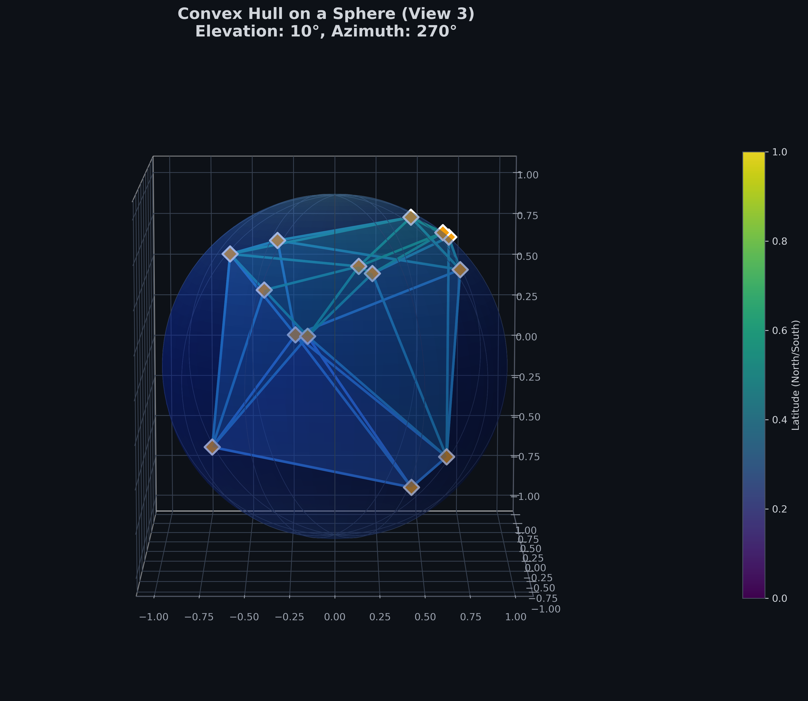

# Convex Hull on a Sphere: Advanced Visualization and Analysis

## 📋 Project Overview

This project provides a comprehensive implementation of convex hull computation and visualization on spherical surfaces. It offers advanced 3D and 2D visualizations with professional styling, interactive controls, and analytical capabilities for understanding spatial relationships of points on a sphere.
# Convex Hull on a Sphere: Advanced Visualization and Analysis





## 📋 Project Overview

This project provides a comprehensive implementation of convex hull computation and visualization on spherical surfaces. It offers advanced 3D and 2D visualizations with professional styling, interactive controls, and analytical capabilities for understanding spatial relationships of points on a sphere.

## 🎯 Purpose and Significance

Convex hull algorithms on spherical surfaces have numerous practical applications across various domains. This implementation serves as both an educational tool for understanding computational geometry concepts and a practical solution for real-world spatial analysis problems.

## 🚀 Key Features

- **Advanced 3D Visualizations**: Interactive spherical representations with enhanced grids and professional styling
- **Multiple Map Projections**: Support for various 2D projections (Mollweide, Plate Carrée, Robinson, Orthographic)
- **Interactive Controls**: Real-time parameter adjustments for exploration and analysis
- **Comprehensive Metrics**: Calculation of hull area, perimeter, and other geometric properties
- **Export Capabilities**: High-quality PNG export for publications and presentations
- **Professional Styling**: Custom color schemes and optimized visual design

## 🔬 Technical Implementation

### Core Algorithms
- **Spherical to Cartesian Conversion**: Accurate coordinate transformation
- **Convex Hull Computation**: Using SciPy's optimized algorithms
- **Spherical Geometry Calculations**: Area and perimeter computations on curved surfaces

### Visualization Technologies
- **Matplotlib 3D**: Advanced 3D rendering with custom lighting and shading
- **Cartopy**: Geographic projections and map features
- **IPyWidgets**: Interactive controls for parameter adjustment
- **Custom Color Mapping**: Thematic coloring based on geographic properties

## 🌍 Applications and Use Cases

### 1. Geographic Information Systems (GIS)
- **Service Area Delineation**: Determining coverage areas for facilities
- **Regional Boundary Definition**: Creating optimal regional partitions
- **Environmental Monitoring**: Identifying affected areas around pollution sources

### 2. Astronomy and Space Science
- **Constellation Mapping**: Defining boundaries of star groups
- **Satellite Coverage Analysis**: Determining communication coverage areas
- **Celestial Navigation**: Visualizing navigational regions

### 3. Network and Infrastructure Planning
- **Wireless Network Coverage**: Optimizing tower placement and coverage areas
- **Transportation Networks**: Planning service routes and coverage zones
- **Resource Distribution**: Optimizing resource allocation across geographic areas

### 4. Climate Science and Meteorology
- **Weather Pattern Analysis**: Delineating regions affected by weather systems
- **Climate Zone Definition**: Identifying homogeneous climate regions
- **Ocean Current Mapping**: Visualizing marine current boundaries

### 5. Urban Planning and Demographics
- **Population Distribution Analysis**: Identifying demographic clusters
- **Service Accessibility**: Planning public service locations
- **Urban Sprawl Analysis**: Monitoring city expansion patterns

### 6. Defense and Security
- **Surveillance Coverage**: Planning optimal sensor placement
- **Strategic Area Definition**: Identifying critical geographic regions
- **Search and Rescue Operations**: Optimizing search patterns

### 7. Scientific Research
- **Biodiversity Studies**: Mapping species distribution ranges
- **Geological Analysis**: Defining geological formation boundaries
- **Archaeological Site Planning**: Determining excavation area boundaries

## 📊 Technical Specifications

### Input Data Format
- Latitude/Longitude coordinates in decimal degrees
- Support for random point generation and clustered distributions
- Flexible input handling for various data sources

### Output Capabilities
- Multiple 3D perspective views
- Various 2D map projections
- Comprehensive metrics reporting
- High-resolution export options (up to 300 DPI)

### Performance Considerations
- Optimized for medium-sized datasets (up to 1,000 points)
- Efficient spherical geometry calculations
- Memory-conscious implementation

## 🛠️ Installation and Usage

### Requirements
```bash
pip install numpy scipy matplotlib cartopy ipywidgets
```

### Basic Usage
```python
# Import and initialize
from convex_hull_sphere import convex_hull_on_sphere, plot_convex_hull_3d

# Create sample points
points = [[40.7, -74.0], [34.0, -118.2], [48.8, 2.3], [-33.9, 151.2]]

# Compute and visualize
hull, cartesian_points = convex_hull_on_sphere(points)
plot_convex_hull_3d(hull, cartesian_points)
```

## 📈 Advanced Features

### Interactive Exploration
- Adjustable viewing angles and perspectives
- Toggleable grid and Earth visualization
- Multiple projection types for comparative analysis

### Analytical Capabilities
- Spherical area and perimeter calculations
- Vertex identification and analysis
- Coverage percentage calculations

### Export Functionality
- Batch export of multiple visualizations
- Customizable output quality and format
- Timestamped filenames for organization

## 🔍 Methodological Approach

### Mathematical Foundation
The implementation uses spherical geometry principles to accurately compute convex hulls on curved surfaces, addressing the unique challenges of spherical coordinates compared to planar geometry.

### Visualization Techniques
- **Depth Perception Enhancement**: Custom lighting and shading
- **Geographic Context**: Integrated map features and grids
- **Information Hierarchy**: Strategic use of color and size coding

## 🎓 Educational Value

This project serves as an excellent resource for:
- Computational geometry education
- Geographic information science training
- Scientific visualization techniques
- Python programming for spatial analysis

## 📝 Future Enhancements

Potential improvements and extensions:
- GPU acceleration for large datasets
- Real-time data integration
- Additional projection types
- Web-based interactive version
- Machine learning integration for optimal point placement

## 🤝 Contributing

We welcome contributions in the following areas:
- Additional projection implementations
- Performance optimization
- New visualization techniques
- Application-specific extensions

## 📚 References

1. Barber, C. B., Dobkin, D. P., & Huhdanpaa, H. (1996). The Quickhull algorithm for convex hulls.
2. Snyder, J. P. (1987). Map Projections: A Working Manual.
3. O'Rourke, J. (1998). Computational Geometry in C.

## 📄 License

This project is available for academic and research use. For commercial applications, please contact the maintainers.

## 🙏 Acknowledgments

- SciPy and Matplotlib communities for excellent computational geometry tools
- Cartopy developers for geographic projection support
- Research institutions advancing spherical geometry applications

---

*This project demonstrates the powerful intersection of computational geometry, geographic information science, and scientific visualization, providing valuable tools for researchers, planners, and analysts working with spatial data on spherical surfaces.*
